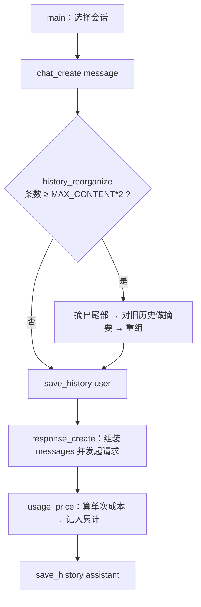

# LLM_API 实践项目：多会话对话服务原型

> 对应理论笔记：[`theory/LLM_API/`](../../theory/LLM_API/)　｜　逐段实现讲解：[`具体代码实现.md`](../../theory/LLM_API/具体代码实现.md)

一个不依赖任何框架的对话服务原型：只用 `openai` + `python-dotenv`，把「多会话 / 多轮上下文 / 历史摘要 / 用量成本 / 测试」这几件事手写一遍。

## 做了什么

- **多会话隔离**：`sessions` 字典按会话名保存 `ChatServer` 实例，互不干扰
- **多轮上下文**：每轮把完整 `messages` 重新发一次（模型没有记忆，服务端不保存会话）
- **历史摘要**：消息条数达到 `MAX_CONTENT*2` 时，先摘出要保留的尾部，再让模型对旧历史做摘要压缩
- **用量记账**：单次与累计的成本、token 数、缓存命中率
- **测试**：3 个集成测试，用 `monkeypatch` 打桩替换 API 调用，不联网、不花钱，覆盖到摘要分支

## 结构

```
LLM_API/
├── main.py              # 会话选择 + 对话循环（程序入口）
├── chat_server.py       # 对话编排：组装请求、调用 API、写入历史、触发摘要
├── usage.py             # 用量计算与累计记账（OncePrice / TotalPrice）
├── config.py            # .env → Config（dataclass, frozen=True）
├── conftest.py          # 空文件，把项目根目录加入 pytest 的 sys.path
├── test/
│   └── test_chat_server.py
├── requirements.txt
└── .env.example
```

## 调用链



## 怎么跑

```bash
pip install -r requirements.txt
cp .env.example .env        # Windows: copy .env.example .env
# 打开 .env 填入自己的 LLM_API_KEY
python main.py              # 输入会话名开始，输入 exit 退出
```

## 怎么测

```bash
python -m pytest test -q
```

## 为什么这样设计

- **Config 用 `dataclass(frozen=True)`**：所有参数集中一处、运行时不可改，避免魔法数字散落各处
- **提示词做成入参**：正常对话和摘要各一套提示词，复用同一个 `response_create()`
- **记账放在 `usage_price()`**：`price()` 保持纯计算，谁调用都不会偷偷改累计账本
- **先裁剪再摘要**：摘要在发请求前把要保留的尾部从 `self.history` 摘掉，摘要只覆盖旧历史
